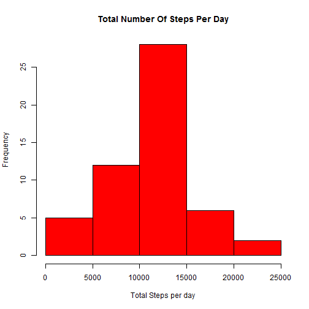
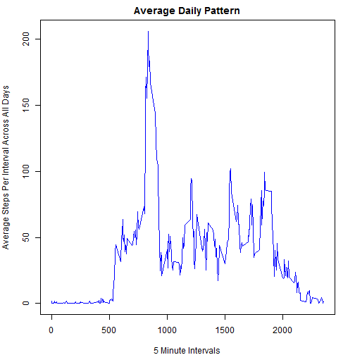
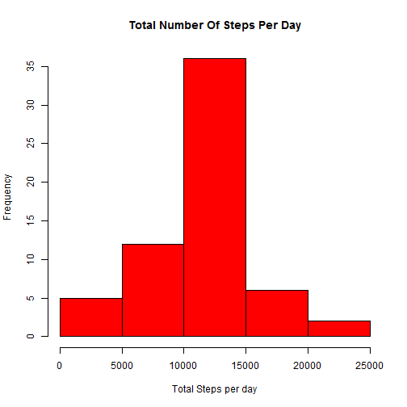
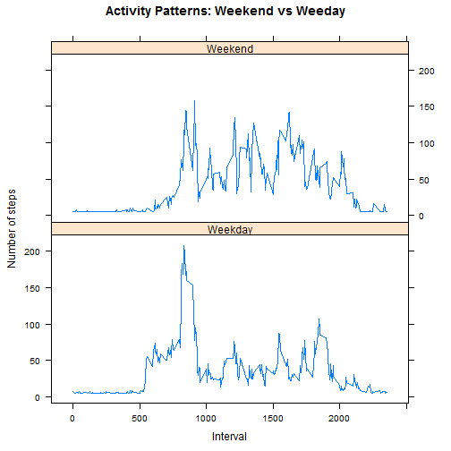

**Activity Data Analysis**
==================================================
## Author: K. Lehabe
## Date : 13 August 2018  
  

  
Read in the Activity.csv input file.

```r
activity <- read.csv("activity.csv")
```
Checking the data, I noticed that there were some NA values in the steps column.
These will impact the results, therefore we need to remove them. 
Also convert the date column to Date format.


```r
# Convert date field from factor to date
 activity$date <- as.Date(activity$date)
# Remove NAs
 activity_no_NA <-activity[!is.na(activity$steps),]
```

## Steps Per Day
The histogram below shows how the averages steps per day are distributed. 

```r
# Sum the Steps per day excluding NAs
steps_per_day <-aggregate(activity_no_NA$steps ~ activity_no_NA$date, FUN=sum, )
colnames(steps_per_day) <- c("Date", "Steps")
#Create a histogram
hist(steps_per_day$Steps, main="Total Number Of Steps Per Day", col="red", xlab="Total Steps per day")
```



```r
# Calculate the mean
mean(steps_per_day$Steps)
```

```
## [1] 10766.19
```

```r
median(steps_per_day$Steps)
```

```
## [1] 10765
```
The mean steps taken per day is 1.0766189 &times; 10<sup>4</sup>  and the median steps per day is 10765 .

## Average Daily Pattern

```r
library(dplyr)

# Get average steps per interval
  steps_per_interval <- activity_no_NA %>% 
                    group_by(interval)  %>%
                   summarize(average_steps =(mean(steps)))
#Plot
par(mar=c(4,4,2,2))
with(steps_per_interval,
     plot(interval,
          average_steps,
          type="l",
          col = "blue",
		      main= "Average Daily Pattern",
          xlab="5 Minute Intervals",
          ylab="Average Steps Per Interval Across All Days"))
```




```r
  # Get the max value and the interval 
  max_step <- max(steps_per_interval$average_steps)
  steps_per_interval[steps_per_interval$average_steps== max_step, ]
```

```
## # A tibble: 1 x 2
##   interval average_steps
##      <int>         <dbl>
## 1      835          206.
```
    
On Average the highest number of steps was 206.1698113  in interval 835
  
## Imputing Missing Values.

There are 2304 missing values in the source file. We populate the NAs with the mean for the interval.


```r
activity_impute <- activity
na_steps <- is.na(activity_impute$steps)
mean_steps <- mean(steps_per_interval$average_steps, na.rm=TRUE)
activity_impute$steps[na_steps] <- mean_steps
```
The histogram below shows how the averages steps per day are distributed when we filled in the NAs. There are no 0 NA values in the output.


```r
# Sum the Steps per day for everything
steps_per_day_all <-aggregate(activity_impute$steps ~ activity_impute$date, FUN=sum, )
colnames(steps_per_day_all) <- c("Date", "Steps")
#Create a histogram
hist(steps_per_day_all$Steps, main="Total Number Of Steps Per Day", col="red", xlab="Total Steps per day")
```



```r
# Calculate the mean and median
mean(steps_per_day_all$Steps)
```

```
## [1] 10766.19
```

```r
median(steps_per_day_all$Steps)
```

```
## [1] 10766.19
```

The mean of the new dataframe is and the median 1.0766189 &times; 10<sup>4</sup>  and the median steps per day is 1.0766189 &times; 10<sup>4</sup> . Based on the observation above, the distribution of the data is similar, with higher frequency in the second plot. The mean did not change and the median changed slightly, being the same as the mean.

## Activity Patterns: Weekdays vs Weekends.


```r
#create a new column for day and categorise it
activity_days <- mutate(activity_impute, day=weekdays(activity_impute$date))

activity_days$day_category <- ifelse( activity_days$day %in% c("Saturday", "Sunday"), "Weekend", "Weekday")

#summarise by interval and category

  steps_per_interval_wd <- activity_days %>% 
                    group_by(interval, day_category)  %>%
                   summarize(average_steps =(mean(steps)))
  #plot
  library(lattice) 

  xyplot(average_steps ~ interval | factor(day_category),
       data= steps_per_interval_wd,
       layout = c(1, 2),
       xlab="Interval",
       ylab="Number of steps",
       main = "Activity Patterns: Weekend vs Weeday",
       type="l",
       lty=1
       )
```


  
Based on the plot above, there seems to be a difference in weekday vs weekend activities. Overall the weekend activity seems to be higher than weekday. However we see the highest activity observed on a weekday.


  
